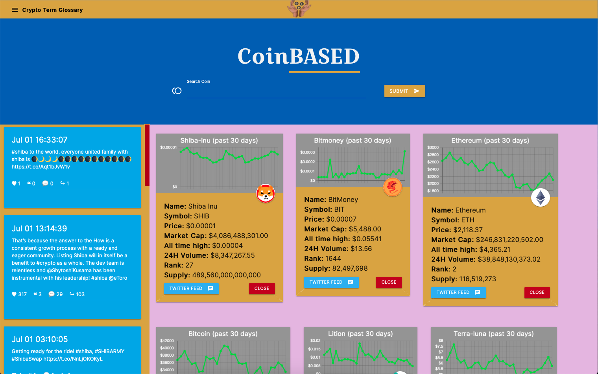

# project-1_RDB
Project 1 for GT Bootcamp

Created by Robert Perez, Brooks Gunn, and David Ludwik

Welcome to CoinBASED, your one stop shop for the latest cryptocurrency data on your favorite coins!

Simply enter the coin of interest in the search bar and a card containing relevant trading data, including 30 day price history chart, pops up in the card area. Hover over the chart to get more precise data on the coin's price history. Each card's twitter button pulls up a bar on the left containing a selection of recent tweets about the relevant coin. Close the card at any time to stay focused on your favorite coins. Upon reopening the page, all previous coins are retained. 

Check it out yourself!

Screenshots:

High level technical explanation:

Crypto data for every supported coin is pulled from coinpaprika upon page load and stored in a data object. This is done in order to minimize latency of card creation. Coin icons are pulled from the coingecko api. Charts are created with the coingecko api and chart.js library. Once a coin name is entered, the crypto data object is searched through, and relevant data is then pulled used to populate the crypto card. Each card is dynamically generated and inserted into the parent card-space div. At the same time an array of active coin names is updated to include the new coin, then the array is re-saved in local storage. 

Upon page load the data is pulled from local storage and used to repopulate the array of active coin names, which is then looped through to call the card generating function for each saved coin. The close button action listener triggers removal of the html related to displaying that card, and the coins name is removed from array of active coins.

The tweet-bar action listener triggers one of four actions based on the different combinations of 2 factors: 
    1. is twitter bar already visible
    2. have you clicked on a new coin

currently hidden and current coin --> makes tweet bar visible
currently hidden and new coin --> clear old tweet bar, repopulate tweet bar with new coin, make visible
currently visible and current coin --> makes tweet bar not visible, 
currently visible and new coin --> clear old tweet bar, repopulate tweet bar with new coin

The tweet fetching function takes in the coin name as a parameter, then makes an api call to twitter with the coin name embedded in the link. The generate function is then called which populates each card in the tweet bar from the tweet data from the api data object. The html for each card is dynamically inserted into the tweet-space.

